<!-- Powered by BMAD-CORE™ -->

# BMad Method — User Guide

This guide will help you understand and effectively use the BMad Method for agile AI-driven planning and development.

## The BMad Plan and Execute Workflow

First, here is the full standard Greenfield Planning + Execution Workflow. Brownfield is very similar, but it's suggested to understand this greenfield first, even if on a simple project before tackling a brownfield project. The BMad Method needs to be installed to the root of your new project folder. For the planning phase, you can optionally perform it with powerful web agents, potentially resulting in higher quality results at a fraction of the cost it would take to complete if providing your own API key or credits in some Agentic tools. For planning, powerful thinking models and larger context - along with working as a partner with the agents will net the best results.

If you are going to use the BMad Method with a Brownfield project (an existing project), review **[Working in the Brownfield](bmad-method-working-with-brownfield.md)**.

If the diagrams below don't render, install Markdown All in One along with the Markdown Preview Mermaid Support plugins to VSCode (or one of the forked clones). With these plugins, if you right click on the tab when open, there should be an Open Preview option, or check the IDE documentation.

### The Planning Workflow (Web UI or Powerful IDE Agents)

Before development begins, BMad follows a structured planning workflow that's ideally done in web UI for cost efficiency:

```mermaid
graph TD
    A["Start: Project Idea"] --> B{"Optional: Analyst Research"}
    B -->|Yes| C["Analyst: Brainstorming (Optional)"]
    B -->|No| G{"Project Brief Available?"}
    C --> C2["Analyst: Market Research (Optional)"]
    C2 --> C3["Analyst: Competitor Analysis (Optional)"]
    C3 --> D["Analyst: Create Project Brief"]
    D --> G
    G -->|Yes| E["PM: Create PRD from Brief (Fast Track)"]
    G -->|No| E2["PM: Interactive PRD Creation (More Questions)"]
    E --> F["PRD Created with FRs, NFRs, Epics & Stories"]
    E2 --> F
    F --> F2{"UX Required?"}
    F2 -->|Yes| F3["UX Expert: Create Front End Spec"]
    F2 -->|No| H["Architect: Create Architecture from PRD"]
    F3 --> F4["UX Expert: Generate UI Prompt for Lovable/V0 (Optional)"]
    F4 --> H2["Architect: Create Architecture from PRD + UX Spec"]
    H --> Q{"Early Test Strategy? (Optional)"}
    H2 --> Q
    Q -->|Yes| R["QA: Early Test Architecture Input on High-Risk Areas"]
    Q -->|No| I
    R --> I["PO: Run Master Checklist"]
    I --> J{"Documents Aligned?"}
    J -->|Yes| K["Planning Complete"]
    J -->|No| L["PO: Update Epics & Stories"]
    L --> M["Update PRD/Architecture as needed"]
    M --> I
    K --> N["📁 Switch to IDE (If in a Web Agent Platform)"]
    N --> O["PO: Shard Documents"]
    O --> P["Ready for SM/Dev Cycle"]

    style A fill:#f5f5f5,color:#000
    style B fill:#e3f2fd,color:#000
    style C fill:#e8f5e9,color:#000
    style C2 fill:#e8f5e9,color:#000
    style C3 fill:#e8f5e9,color:#000
    style D fill:#e8f5e9,color:#000
    style E fill:#fff3e0,color:#000
    style E2 fill:#fff3e0,color:#000
    style F fill:#fff3e0,color:#000
    style F2 fill:#e3f2fd,color:#000
    style F3 fill:#e1f5fe,color:#000
    style F4 fill:#e1f5fe,color:#000
    style G fill:#e3f2fd,color:#000
    style H fill:#f3e5f5,color:#000
    style H2 fill:#f3e5f5,color:#000
    style Q fill:#e3f2fd,color:#000
    style R fill:#ffd54f,color:#000
    style I fill:#f9ab00,color:#fff
    style J fill:#e3f2fd,color:#000
    style K fill:#34a853,color:#fff
    style L fill:#f9ab00,color:#fff
    style M fill:#fff3e0,color:#000
    style N fill:#1a73e8,color:#fff
    style O fill:#f9ab00,color:#fff
    style P fill:#34a853,color:#fff
```



#### Web UI to IDE Transition

**Critical Transition Point**: Once the PO confirms document alignment, you must switch from web UI to IDE to begin the development workflow:

1. **Copy Documents to Project**: Ensure `docs/prd.md` and `docs/architecture.md` are in your project's docs folder (or a custom location you can specify during installation)
2. **Switch to IDE**: Open your project in your preferred Agentic IDE
3. **Document Sharding**: Use the PO agent to shard the PRD and then the Architecture
4. **Begin Development**: Start the Core Development Cycle that follows

#### Planning Artifacts (Standard Paths)

```text
PRD              → docs/prd.md
Architecture     → docs/architecture.md
Sharded Epics    → docs/epics/
Sharded Stories  → docs/stories/
QA Assessments   → docs/qa/assessments/
QA Gates         → docs/qa/gates/
```

### The Core Development Cycle (IDE)

Once planning is complete and documents are sharded, BMad follows a structured development workflow:

```mermaid
graph TD
    A["Development Phase Start"] --> B["SM: Reviews Previous Story Dev/QA Notes"]
    B --> B2["SM: Drafts Next Story from Sharded Epic + Architecture"]
    B2 --> S{"High-Risk Story? (Optional)"}
    S -->|Yes| T["QA: *risk + *design on Draft Story"]
    S -->|No| B3
    T --> U["Test Strategy & Risk Profile Created"]
    U --> B3{"PO: Validate Story Draft (Optional)"}
    B3 -->|Validation Requested| B4["PO: Validate Story Against Artifacts"]
    B3 -->|Skip Validation| C{"User Approval"}
    B4 --> C
    C -->|Approved| D["Dev: Sequential Task Execution"]
    C -->|Needs Changes| B2
    D --> E["Dev: Implement Tasks + Tests"]
    E --> V{"Mid-Dev QA Check? (Optional)"}
    V -->|Yes| W["QA: *trace or *nfr for Early Validation"]
    V -->|No| F
    W --> X["Dev: Address Coverage/NFR Gaps"]
    X --> F["Dev: Run All Validations"]
    F --> G["Dev: Mark Ready for Review + Add Notes"]
    G --> H{"User Verification"}
    H -->|Request QA Review| I["QA: Test Architect Review + Quality Gate"]
    H -->|Approve Without QA| M["IMPORTANT: Verify All Regression Tests and Linting are Passing"]
    I --> J["QA: Test Architecture Analysis + Active Refactoring"]
    J --> L{"QA Decision"}
    L -->|Needs Dev Work| D
    L -->|Approved| M
    H -->|Needs Fixes| D
    M --> N["IMPORTANT: COMMIT YOUR CHANGES BEFORE PROCEEDING!"]
    N --> Y{"Gate Update Needed?"}
    Y -->|Yes| Z["QA: *gate to Update Status"]
    Y -->|No| K
    Z --> K["Mark Story as Done"]
    K --> B

    style A fill:#f5f5f5,color:#000
    style B fill:#e8f5e9,color:#000
    style B2 fill:#e8f5e9,color:#000
    style S fill:#e3f2fd,color:#000
    style T fill:#ffd54f,color:#000
    style U fill:#ffd54f,color:#000
    style B3 fill:#e3f2fd,color:#000
    style B4 fill:#fce4ec,color:#000
    style C fill:#e3f2fd,color:#000
    style D fill:#e3f2fd,color:#000
    style E fill:#e3f2fd,color:#000
    style V fill:#e3f2fd,color:#000
    style W fill:#ffd54f,color:#000
    style X fill:#e3f2fd,color:#000
    style F fill:#e3f2fd,color:#000
    style G fill:#e3f2fd,color:#000
    style H fill:#e3f2fd,color:#000
    style I fill:#f9ab00,color:#fff
    style J fill:#ffd54f,color:#000
    style K fill:#34a853,color:#fff
    style L fill:#e3f2fd,color:#000
    style M fill:#ff5722,color:#fff
    style N fill:#d32f2f,color:#fff
    style Y fill:#e3f2fd,color:#000
    style Z fill:#ffd54f,color:#000
```



## Prerequisites

Before installing BMad Method, ensure you have:

- **Node.js** ≥ 18, **npm** ≥ 9
- **Git** installed and configured
- **(Optional)** VS Code with "Markdown All in One" + "Markdown Preview Mermaid Support" extensions

## Installation

### Optional

If you want to do the planning on the web with Claude (Sonnet 4 or Opus), Gemini Gem (2.5 Pro), or Custom GPTs:

1. Navigate to `dist/teams/`
2. Copy `team-fullstack.txt`
3. Create new Gemini Gem or CustomGPT
4. Upload file with instructions: "Your critical operating instructions are attached, do not break character as directed"
5. Type `/help` to see available commands

### IDE Project Setup

```bash
# Interactive installation (recommended)
npx bmad install
```

## Special Agents

There are two BMad agents — in the future they'll be consolidated into a single BMad-Master.

### BMad-Master

This agent can do any task or command that all other agents can do, aside from actual story implementation. Additionally, this agent can help explain the BMad Method when on the web by accessing the knowledge base and explaining anything to you about the process.

If you don't want to bother switching between different agents aside from the dev, this is the agent for you. Just remember that as the context grows, the performance of the agent degrades, therefore it is important to instruct the agent to compact the conversation and start a new conversation with the compacted conversation as the initial message. Do this often, preferably after each story is implemented.

### BMad-Orchestrator

This agent should NOT be used within the IDE, it is a heavyweight, special-purpose agent that utilizes a lot of context and can morph into any other agent. This exists solely to facilitate the teams within the web bundles. If you use a web bundle you will be greeted by the BMad Orchestrator.

### How Agents Work

#### Dependencies System

Each agent has a YAML section that defines its dependencies:

```yaml
dependencies:
  templates:
    - prd-template.md
    - user-story-template.md
  tasks:
    - create-doc.md
    - shard-doc.md
  data:
    - bmad-kb.md
```

**Key Points:**

- Agents only load resources they need (lean context)
- Dependencies are automatically resolved during bundling
- Resources are shared across agents to maintain consistency

#### Agent Interaction

**In IDE:**

```bash
# Some IDEs, like Cursor or Windsurf for example, utilize manual rules so interaction is done with the '@' symbol
@pm Create a PRD for a task management app
@architect Design the system architecture
@dev Implement the user authentication

# Some IDEs, like Claude Code, use slash commands instead
/pm Create user stories
/dev Fix the login bug
```

#### Interactive Modes

- **Incremental Mode**: Step-by-step with user input
- **YOLO Mode**: Rapid generation with minimal interaction

## IDE Integration

### IDE Best Practices

- **Context Management**: Keep relevant files only in context, keep files as lean and focused as necessary
- **Agent Selection**: Use appropriate agent for task
- **Iterative Development**: Work in small, focused tasks
- **File Organization**: Maintain clean project structure
- **Commit Regularly**: Save your work frequently

## Technical Preferences System

BMad includes a personalization system through the `technical-preferences.md` file located in `.bmad-modules/bmm/data/` - this can help bias the PM and Architect to recommend your preferences for design patterns, technology selection, or anything else you would like to put in here.

### Using with Web Bundles

When creating custom web bundles or uploading to AI platforms, include your `technical-preferences.md` content to ensure agents have your preferences from the start of any conversation.

## Core Configuration

The `bmad-modules/bmm/core-config.yaml` file is a critical config that enables BMad to work seamlessly with differing project structures, more options will be made available in the future. Currently the most important is the devLoadAlwaysFiles list section in the yaml.

### Developer Context Files

Define which files the dev agent should always load:

```yaml
devLoadAlwaysFiles:
  - docs/architecture/coding-standards.md
  - docs/architecture/tech-stack.md
  - docs/architecture/project-structure.md
```

You will want to verify from sharding your architecture that these documents exist, that they are as lean as possible, and contain exactly the information you want your dev agent to ALWAYS load into its context. These are the rules the agent will follow.

As your project grows and the code starts to build consistent patterns, coding standards should be reduced to include only the standards the agent still needs enforced. The agent will look at surrounding code in files to infer the coding standards that are relevant to the current task.

## Getting Help

- **Discord Community**: [Join Discord](https://discord.gg/gk8jAdXWmj)
- **GitHub Issues**: [Report bugs](https://github.com/bmad-code-org/BMAD-METHOD/issues)
- **Documentation**: [Browse docs](https://github.com/bmad-code-org/BMAD-METHOD/docs)
- **YouTube**: [BMadCode Channel](https://www.youtube.com/@BMadCode)

## Conclusion

Remember: BMad is designed to enhance your development process, not replace your expertise. Use it as a powerful tool to accelerate your projects while maintaining control over design decisions and implementation details.
