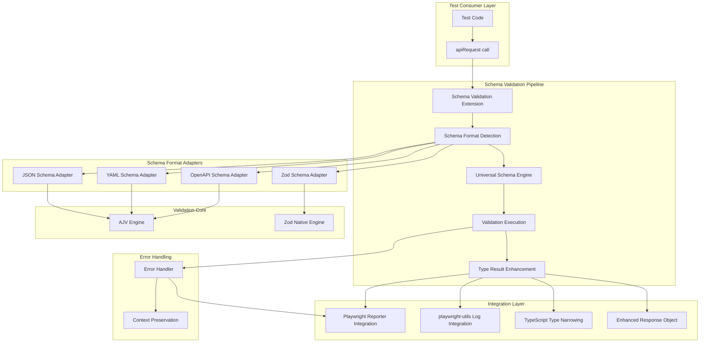
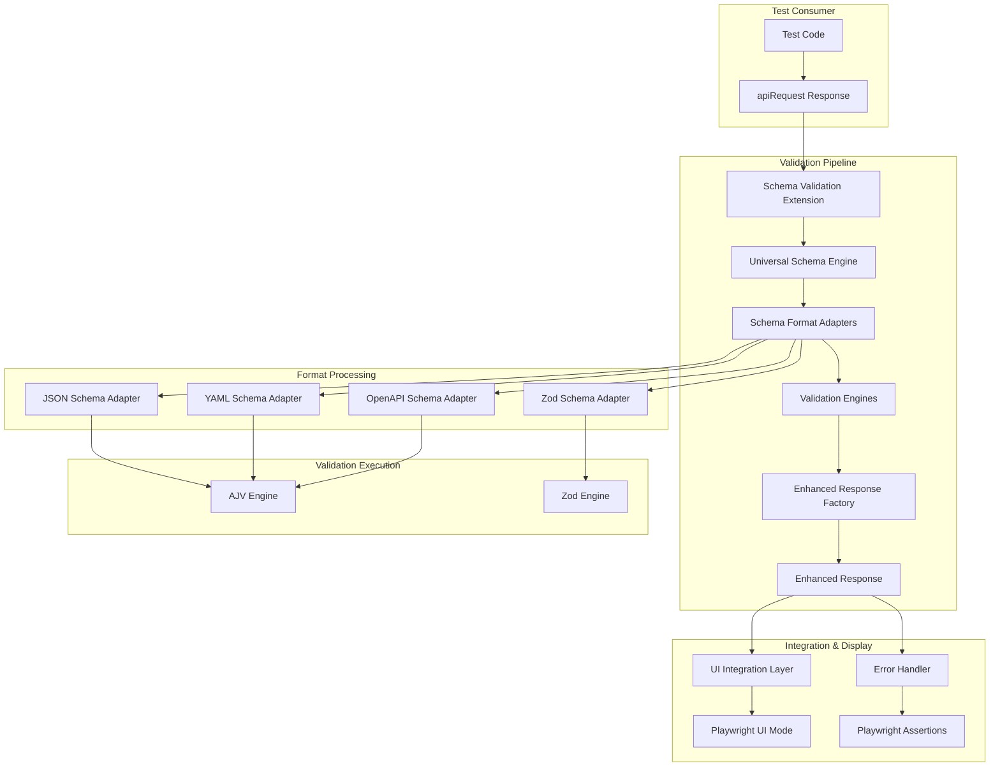

# Schema Validation Fullstack Architecture

## Introduction

This document outlines the complete fullstack architecture for Schema Validation, a transformative feature that **reduces API validation boilerplate by 70-80%** through single-line declarative schema checking. It serves as the single source of truth for AI-driven development, ensuring consistency across the entire technology stack.

**First Principles Innovation**: Schema validation reconceptualizes API responses as **unvalidated data until proven otherwise**. Rather than adding validation as a feature, it transforms response handling into **data quality assurance** with built-in type safety:

```typescript
// Conventional thinking: Validation as separate step
const response = await apiRequest({...})
expect(response.status).toBe(200)  // Manual assertions on unvalidated data
expect(response.data.name).toBe(movie.name) // Missing structural validation

// First principles: Validation as data transformation
const validatedResponse = await apiRequest({...})
  .validateSchema(schema, {
    endpoint: '/movies',
    method: 'POST',
    shape: { status: 200, data: movieProps } // Spot-check critical properties
  })
// Result: Enhanced response with guaranteed data quality + TypeScript narrowing
```

**Revolutionary Architecture Principle**: **Validation is data transformation, not a separate concern**. All API responses flow through schema validation to become trusted, type-safe data structures.

**Core Value Proposition**: **Schema-first response processing** - treat API responses as unreliable until schema validation transforms them into guaranteed data structures with optional selective assertions for critical properties.

This unified approach combines what would traditionally be separate backend and frontend architecture documents, streamlining the development process for modern fullstack applications where these concerns are increasingly intertwined.

### Starter Template or Existing Project

**Existing Project Extension**: This feature extends the existing playwright-utils library architecture, delivering on the PRD's core value proposition of **eliminating 5-10 lines of manual property checking** while introducing a **paradigm shift toward schema-first API response processing**.

The schema validation capability builds upon established patterns while introducing first principles innovations:

- **Functional Core, Fixture Shell**: Existing architectural pattern from playwright-utils
- **Data Transformation Pipeline**: Extends apiRequest to transform raw responses into validated data structures
- **Universal Schema Engine**: First playwright utility to treat all schema formats (JSON, YAML, OpenAPI, Zod) as syntax variants of the same validation logic
- **Zero-Copy Validation**: In-stream validation during response processing, not as separate operation
- **Type System Integration**: Successful validation narrows TypeScript types automatically
- **Sample App Framework**: Leverages existing sample-app for comprehensive format demonstration

**Architectural Constraints & First Principles**:

- Must maintain backward compatibility with existing apiRequest functionality (zero breaking changes)
- Follow established TypeScript strict mode and dual CJS/ESM build patterns
- **Data Quality Assurance**: Treat API response validation as core reliability feature, not optional testing utility
- **Performance by Design**: Zero-copy validation integrated into response processing pipeline
- **Error Context Preservation**: Validation failures include full request/response context for actionable debugging
- Conform to playwright-utils "functional core, fixture shell" design philosophy

### Change Log

| Date       | Version | Description                            | Author  |
| ---------- | ------- | -------------------------------------- | ------- |
| 2025-09-17 | 1.0     | Initial schema validation architecture | Winston |

## High Level Architecture

### Technical Summary

Schema validation implements a **data transformation pipeline architecture** that extends the existing playwright-utils `apiRequest` utility with built-in schema validation capabilities. The system treats API response validation as a core data quality assurance feature, transforming raw HTTP responses into validated, type-safe data structures through a universal schema engine that supports multiple format types (JSON Schema, YAML Schema, OpenAPI 3.0/Swagger 2.0, and Zod schemas).

The architecture follows the established "functional core, fixture shell" pattern while introducing zero-copy validation that processes schemas during response handling rather than as separate validation steps. Integration with Playwright's test reporting system, the existing playwright-utils log utility, and the **apiRequest UI Mode** ensures that validation failures provide actionable debugging information with full request/response context. The combined UI framework extends the existing visual API display to include **rich schema validation feedback** - showing validation results, schema compliance status, and formatted validation errors directly in Playwright's UI interface, maintaining the library's commitment to developer experience while achieving the PRD goal of 70-80% validation boilerplate reduction.

### Platform and Infrastructure Choice

**Platform**: Library Extension within existing playwright-utils ecosystem
**Key Services**: AJV-based validation engine with format-specific adapters, TypeScript type integration, Playwright assertion integration, playwright-utils log utility for enhanced debugging
**Deployment Host and Regions**: NPM package distribution via existing playwright-utils publishing pipeline

**Rationale**: Extending the existing playwright-utils library maximizes adoption by building on established patterns and eliminates integration friction for existing users. The library-first approach ensures zero deployment overhead while maintaining compatibility with all Playwright-supported environments.

### Repository Structure

**Structure**: Monorepo extension within existing playwright-utils structure
**Monorepo Tool**: Existing npm workspaces approach
**Package Organization**: New `src/schema-validation/` module following established subpath export patterns

The schema validation capability integrates as a new utility module within the existing `src/` directory structure, maintaining consistency with other utilities like `api-request`, `auth-session`, and `file-utils` while enabling independent development and testing.

### High Level Architecture Diagram



### Architectural Patterns

- **Pipeline Pattern**: Request → Validation → Enhanced Response flow with built-in error handling and context preservation
- **Adapter Pattern**: Universal schema engine with format-specific adapters for JSON, YAML, OpenAPI, and Zod schemas
- **Decorator Pattern**: Enhanced response objects that maintain original functionality while adding validation metadata
- **Strategy Pattern**: Pluggable validation strategies based on schema format and validation options
- **Chain of Responsibility**: Fluent chaining that maintains request context throughout the validation pipeline

## Tech Stack

This is the DEFINITIVE technology selection for the schema validation feature. All development must use these exact versions and approaches.

| Category           | Technology           | Version  | Purpose                          | Rationale                                               |
| ------------------ | -------------------- | -------- | -------------------------------- | ------------------------------------------------------- |
| Core Language      | TypeScript           | 5.8.3    | Type-safe development            | Matches existing playwright-utils strict mode config    |
| Validation Engine  | AJV                  | ^8.17.1  | JSON/YAML/OpenAPI validation     | Industry standard, high performance, extensive features |
| Zod Integration    | Zod                  | ^3.23.8  | Zod schema validation            | Native TypeScript integration, peer dependency          |
| YAML Processing    | js-yaml              | ^4.1.0   | YAML schema file parsing         | Lightweight, reliable YAML parser                       |
| OpenAPI Processing | swagger-parser       | ^10.0.3  | OpenAPI document parsing         | Comprehensive OpenAPI 3.0/Swagger 2.0 support           |
| HTTP Client        | playwright-utils     | existing | API request execution            | Extends existing apiRequest utility                     |
| Logging            | playwright-utils/log | existing | Enhanced debugging & reporting   | Integrated step tracking and object logging             |
| UI Integration     | apiRequest UI Mode   | existing | Visual schema validation display | Extends existing UI framework for validation feedback   |
| Test Framework     | Playwright           | ^1.54.1  | Test execution environment       | Peer dependency from existing structure                 |
| Build System       | TypeScript           | 5.8.3    | Dual CJS/ESM compilation         | Maintains compatibility with existing build             |
| Type Generation    | TypeScript           | 5.8.3    | Response type narrowing          | Compile-time type safety from validation success        |
| Error Handling     | playwright-utils     | existing | Context preservation & reporting | Integrates with existing error handling patterns        |
| Module System      | Subpath Exports      | Node 16+ | Individual utility imports       | Maintains bundle size optimization                      |

## Data Models

The schema validation system defines core data models that enable type-safe validation workflows while maintaining compatibility with existing playwright-utils patterns.

### Schema Validation Options

**Purpose**: Configuration interface for validation behavior and schema targeting

**Key Attributes**:

- endpoint?: string - OpenAPI endpoint path for schema extraction
- method?: string - HTTP method for OpenAPI schema targeting
- status?: number - Expected status code for OpenAPI response schema selection
- shape?: object - spok-like selective property validation object
- mode?: 'throw' | 'return' - Behavior on validation failure (default: 'throw', recommended: always 'throw' for clean test assertions)
- uiMode?: boolean - Override apiRequest UI mode for validation-specific display (inherits from apiRequest by default)

#### TypeScript Interface

```typescript
type ValidationOptions = {
  endpoint?: string
  method?: 'GET' | 'POST' | 'PUT' | 'DELETE' | 'PATCH' | 'HEAD'
  status?: number
  shape?: Record<string, any> | ((value: any) => boolean)
  mode?: 'throw' | 'return'
  uiMode?: boolean // Override for validation-specific UI (inherits from apiRequest)
}
```

#### Relationships

- Used by Enhanced Response Object for validation execution
- Consumed by Schema Format Adapters for schema targeting
- Integrated with UI Integration Layer for visual feedback

### Schema Format Types

**Purpose**: Union type defining all supported schema formats with format-specific metadata

**Key Attributes**:

- format: 'json' | 'yaml' | 'openapi' | 'zod' - Schema format identifier
- schema: unknown - The actual schema content (varies by format)
- metadata?: object - Format-specific information (version, title, etc.)

#### TypeScript Interface

```typescript
type SchemaFormat =
  | JsonSchemaFormat
  | YamlSchemaFormat
  | OpenApiSchemaFormat
  | ZodSchemaFormat

type JsonSchemaFormat = {
  format: 'json'
  schema: object
  metadata?: {
    version?: string
    title?: string
    description?: string
  }
}

type YamlSchemaFormat = {
  format: 'yaml'
  schema: object // Parsed YAML content
  metadata?: {
    sourceFile?: string
    title?: string
  }
}

type OpenApiSchemaFormat = {
  format: 'openapi'
  schema: OpenAPIV3.Document | OpenAPIV3_1.Document
  metadata?: {
    version: '3.0' | '3.1' | '2.0'
    title?: string
    servers?: string[]
  }
}

type ZodSchemaFormat = {
  format: 'zod'
  schema: z.ZodSchema<any>
  metadata?: {
    description?: string
    examples?: any[]
  }
}
```

#### Relationships

- Processed by Universal Schema Engine
- Consumed by format-specific adapters (JSON, YAML, OpenAPI, Zod)
- Used for UI Mode schema preview display

### Validation Result

**Purpose**: Comprehensive validation outcome with success/failure details and UI integration data

**Key Attributes**:

- success: boolean - Overall validation result
- data?: T - Validated and type-narrowed response data (on success)
- errors?: ValidationError[] - Detailed validation failure information
- schemaInfo: SchemaInfo - Schema format and metadata used for validation
- performance: ValidationPerformance - Timing and performance metrics
- uiData?: ValidationUIData - Rich UI display information

#### TypeScript Interface

```typescript
type ValidationResult<T = unknown> = {
  success: boolean
  data?: T
  errors?: ValidationError[]
  schemaInfo: SchemaInfo
  performance: ValidationPerformance
  uiData?: ValidationUIData
}

type ValidationError = {
  path: string
  message: string
  expectedType?: string
  actualValue?: any
  schemaRule?: string
}

type SchemaInfo = {
  format: 'json' | 'yaml' | 'openapi' | 'zod'
  title?: string
  version?: string
  endpoint?: string
  method?: string
}

type ValidationPerformance = {
  validationTimeMs: number
  schemaLoadTimeMs: number
  totalTimeMs: number
}

type ValidationUIData = {
  statusIcon: '✅' | '❌' | '⚠️'
  schemaPreview: string
  validationSummary: string
  errorDetails?: string[]
  shapeValidationResults?: Record<string, boolean>
}
```

#### Relationships

- Returned by Enhanced Response Object after validation
- Consumed by UI Integration Layer for visual display
- Used by Error Handler for context preservation
- Integrated with Playwright Reporter for test reporting

### Enhanced Response Object

**Purpose**: Extended API response object that includes validation capabilities and maintains backward compatibility

**Key Attributes**:

- status: number - HTTP status code (inherited from apiRequest)
- body: T - Response body (inherited from apiRequest)
- validateSchema: Method - Fluent validation method for chaining
- validationResult?: ValidationResult - Cached validation result
- originalResponse: ApiRequestResponse - Original response for compatibility

#### TypeScript Interface

```typescript
type EnhancedApiResponse<T = unknown> = ApiRequestResponse<T> & {
  validateSchema<V = T>(
    schema: SchemaFormat | object | z.ZodSchema,
    options?: ValidationOptions
  ): Promise<EnhancedApiResponse<V>>

  validationResult?: ValidationResult<T>
  originalResponse: ApiRequestResponse<T>
}

// Maintains full compatibility with existing apiRequest responses
type ApiRequestResponse<T = unknown> = {
  status: number
  body: T
}
```

#### Relationships

- Extends existing ApiRequestResponse for backward compatibility
- Uses ValidationOptions for configuration
- Returns ValidationResult through validationResult property
- Integrates with UI Integration Layer when uiMode is enabled
- Maintains fluent chaining through validateSchema method return

## API Specification

The schema validation API extends the existing apiRequest utility with fluent chaining capabilities, providing a single method that handles all schema formats and validation options.

### Core validateSchema Method

Based on the data transformation principles, the validateSchema method is the primary interface for all validation operations:

```typescript
async validateSchema<T>(
  schema: SchemaFormat | object | z.ZodSchema | string,
  options?: ValidationOptions
): Promise<EnhancedApiResponse<T>>
```

### Method Signature Details

**Parameters:**

- `schema`: The schema to validate against. Supports:
  - Direct schema objects (JSON Schema, parsed YAML)
  - Zod schema instances
  - File paths to schema files (YAML, JSON)
  - OpenAPI document objects
- `options`: Optional validation configuration (ValidationOptions interface)

**Return Type:**

- `EnhancedApiResponse<T>`: Extended response object with validation results and continued fluent chaining

### Usage Patterns

#### JSON Schema Validation

```typescript
// Direct JSON schema object
const response = await apiRequest({
  method: 'POST',
  path: '/movies',
  body: movie
}).validateSchema({
  type: 'object',
  properties: {
    status: { type: 'number' },
    data: {
      type: 'object',
      properties: {
        id: { type: 'number' },
        name: { type: 'string' }
      }
    }
  }
})
```

#### YAML Schema Validation

```typescript
// YAML schema file path - UI mode inherited from apiRequest settings
const response = await apiRequest({
  method: 'GET',
  path: '/users',
  uiMode: true // Enables UI for both request/response AND validation results
}).validateSchema('./schemas/user-list.yaml')
```

#### OpenAPI Schema Validation

```typescript
// OpenAPI document with endpoint targeting
const response = await apiRequest({
  method: 'POST',
  path: '/movies',
  body: movieData
}).validateSchema(openApiDoc, {
  endpoint: '/movies',
  method: 'POST',
  status: 201,
  shape: {
    status: 201,
    data: { name: spok.string, year: spok.number }
  }
})
```

#### Zod Schema Validation

```typescript
import { z } from 'zod'

const MovieSchema = z.object({
  status: z.number(),
  data: z.object({
    id: z.number(),
    name: z.string(),
    year: z.number()
  })
})

const response = await apiRequest({
  method: 'GET',
  path: '/movies/123'
}).validateSchema(MovieSchema)

// TypeScript automatically narrows response.body to inferred type
expect(response.body.data.name).toBe('Test Movie')
```

### Advanced Usage Patterns

#### Clean Assertion-Style Validation

```typescript
// Schema validation as seamless assertion - no try/catch needed
const response = await apiRequest({
  method: 'POST',
  path: '/api/complex-operation',
  body: operationData
}).validateSchema(operationSchema, {
  shape: {
    status: 201,
    data: {
      operationId: spok.string,
      status: 'pending'
    }
  }
})

// Validation success is implicit - response.body is guaranteed valid and type-safe
const operationId = response.body.data.operationId
expect(operationId).toBeTruthy() // Additional assertions as needed
```

#### Assertion-First Philosophy

```typescript
// Tests remain clean and deterministic - validation failure = test failure
test('should create resource successfully', async ({ apiRequest }) => {
  const response = await apiRequest({
    method: 'POST',
    path: '/api/resources',
    body: resourceData
  }).validateSchema(resourceSchema)

  // No conditionals needed - schema validation ensures data quality
  expect(response.body.data.id).toBeGreaterThan(0)
  expect(response.body.data.status).toBe('active')

  // Continue with validated data
  await apiRequest({
    method: 'GET',
    path: `/api/resources/${response.body.data.id}`
  }).validateSchema(resourceSchema)
})
```

### Integration with Existing Patterns

#### Fixture Integration - Keep Fixtures Clean

```typescript
// Fixtures remain simple - no hidden validation logic
export const test = baseApiRequestFixture.extend<CrudParams>({
  addMovie: async ({ apiRequest }, use) => {
    const addMovie = async (
      token: string,
      body: Omit<Movie, 'id'>,
      baseUrl?: string
    ) =>
      apiRequest<CreateMovieResponse>({
        method: 'POST',
        path: '/movies',
        baseUrl,
        body,
        headers: { Authorization: token }
      })

    await use(functionTestStep('Add Movie', addMovie))
  }
})

// Schema validation happens explicitly in spec files
test('should create movie with schema validation', async ({
  addMovie,
  authToken
}) => {
  // Explicit validation - clear and visible in the test
  const response = await addMovie(authToken, movieData).validateSchema(
    movieSchema,
    {
      endpoint: '/movies',
      method: 'POST'
    }
  )

  // Continue with guaranteed valid data
  expect(response.body.data.id).toBeDefined()
})
```

#### Multi-Format Schema Support

```typescript
test('supports all schema formats', async ({ apiRequest }) => {
  const movieData = { name: 'Test Movie', year: 2024 }

  // JSON Schema
  await apiRequest({
    method: 'POST',
    path: '/movies',
    body: movieData
  }).validateSchema(jsonSchema)

  // YAML Schema file
  await apiRequest({
    method: 'POST',
    path: '/movies',
    body: movieData
  }).validateSchema('./schemas/movie-response.yaml')

  // OpenAPI targeting
  await apiRequest({
    method: 'POST',
    path: '/movies',
    body: movieData
  }).validateSchema(openApiDoc, { endpoint: '/movies', method: 'POST' })

  // Zod schema
  await apiRequest({
    method: 'POST',
    path: '/movies',
    body: movieData
  }).validateSchema(MovieResponseSchema)
})
```

### Error Response Format

Validation failures provide comprehensive error information:

```typescript
type ValidationFailureError = Error & {
  name: 'ValidationError'
  message: string
  validationResult: ValidationResult
  requestContext: {
    method: string
    path: string
    body?: any
    headers?: Record<string, string>
  }
  responseContext: {
    status: number
    body: any
  }
}
```

### Performance Considerations

- **Zero-Copy Validation**: Validation occurs during response processing without additional serialization
- **Schema Caching**: Parsed schemas are cached for repeated validations
- **Conditional UI Mode**: UI rendering only occurs when explicitly enabled
- **Type Narrowing**: TypeScript type inference happens at compile-time with no runtime overhead

## Components

The schema validation system is built around focused components that implement the data transformation pipeline architecture, maintaining clear separation of concerns while enabling seamless integration.

### Schema Validation Extension

**Responsibility**: Extends apiRequest responses with validateSchema method and manages validation workflow

**Key Interfaces:**

- `.validateSchema<T>(schema, options)` - Primary validation method
- Integration with existing apiRequest response objects
- Fluent chaining support for continued operations

**Dependencies**: Universal Schema Engine, Enhanced Response Object factory

**Technology Stack**: TypeScript method decoration, Promise chaining, apiRequest response enhancement

### Universal Schema Engine

**Responsibility**: Core validation logic that processes all schema formats through unified interface

**Key Interfaces:**

- `validateData(data, schemaFormat, options)` - Main validation entry point
- Format detection and routing to appropriate adapters
- Result standardization across all schema formats

**Dependencies**: Schema Format Adapters (JSON, YAML, OpenAPI, Zod), AJV Engine, Zod Engine

**Technology Stack**: TypeScript unions, adapter pattern implementation, validation result standardization

### Schema Format Adapters

#### JSON Schema Adapter

**Responsibility**: Processes JSON Schema documents and converts them to AJV-compatible format
**Key Interfaces:**

- `parseJsonSchema(schema)` - JSON Schema parsing and validation
- `convertToAjv(jsonSchema)` - AJV format conversion
  **Dependencies**: AJV Engine
  **Technology Stack**: JSON Schema specification compliance, AJV integration

#### YAML Schema Adapter

**Responsibility**: Processes YAML schema files and documents
**Key Interfaces:**

- `loadYamlSchema(filePath)` - File-based YAML loading
- `parseYamlSchema(yamlContent)` - YAML content parsing
  **Dependencies**: js-yaml parser, JSON Schema Adapter (for validation)
  **Technology Stack**: YAML parsing, file system access, schema caching

#### OpenAPI Schema Adapter

**Responsibility**: Extracts response schemas from OpenAPI documents using endpoint targeting
**Key Interfaces:**

- `extractSchema(openApiDoc, endpoint, method, status)` - Schema extraction
- `resolveSchemaReferences(schema)` - Reference resolution for complex schemas
  **Dependencies**: swagger-parser, JSON Schema Adapter
  **Technology Stack**: OpenAPI 3.0/3.1 specification parsing, JSON Schema extraction

#### Zod Schema Adapter

**Responsibility**: Processes Zod schemas using native Zod validation
**Key Interfaces:**

- `validateWithZod(data, zodSchema)` - Direct Zod validation
- `extractZodMetadata(zodSchema)` - Schema introspection for UI display
  **Dependencies**: Zod library (peer dependency)
  **Technology Stack**: Zod native validation, TypeScript type extraction

### Validation Engines

#### AJV Engine

**Responsibility**: High-performance JSON Schema validation using AJV library
**Key Interfaces:**

- `compile(jsonSchema)` - Schema compilation with caching
- `validate(data, compiledSchema)` - Data validation execution
  **Dependencies**: AJV library, schema caching layer
  **Technology Stack**: AJV ^8.17.1, schema compilation optimization

#### Zod Engine

**Responsibility**: TypeScript-native validation using Zod schemas
**Key Interfaces:**

- `parse(data, zodSchema)` - Zod parsing with type narrowing
- `safeParse(data, zodSchema)` - Non-throwing validation
  **Dependencies**: Zod library
  **Technology Stack**: Zod native APIs, TypeScript type inference

### Enhanced Response Object Factory

**Responsibility**: Creates enhanced response objects with validation capabilities while maintaining backward compatibility

**Key Interfaces:**

- `enhance(apiResponse)` - Adds validateSchema method to existing responses
- Maintains original response properties and methods
- Provides validation result caching

**Dependencies**: Schema Validation Extension, UI Integration Layer

**Technology Stack**: TypeScript object enhancement, method binding, response proxy patterns

### UI Integration Layer

**Responsibility**: Extends existing apiRequest UI Mode with schema validation visual feedback

**Key Interfaces:**

- `renderValidationResults(validationResult, uiMode)` - Visual validation display
- Integration with Playwright's UI display system
- Schema preview and error formatting

**Dependencies**: playwright-utils/log, Playwright UI system, existing apiRequest UI Mode

**Technology Stack**: HTML generation, Playwright attachments API, existing UI Mode framework extension

### Error Handler

**Responsibility**: Transforms validation failures into actionable Playwright assertion failures with full context

**Key Interfaces:**

- `createValidationError(validationResult, context)` - Error object creation
- Context preservation (request/response details)
- Integration with Playwright's error reporting

**Dependencies**: Playwright assertion system, playwright-utils/log

**Technology Stack**: Custom error types, context serialization, Playwright reporter integration

## Component Interaction Diagram



## Usage Patterns & Examples

### Chaining vs Separate Assignment

The schema validation feature supports both fluent chaining and separate assignment patterns, giving developers flexibility in their coding style and test organization:

#### Chaining Pattern (Recommended)

**Fluent chaining provides the most concise syntax and follows the assertion-first philosophy:**

```typescript
// Single-line validation with chaining
const response = await apiRequest({
  method: 'POST',
  path: '/movies',
  body: movieData
}).validateSchema(movieSchema, {
  endpoint: '/movies',
  method: 'POST',
  shape: { status: 201, data: movieProps }
})

// Access validated data directly
expect(response.body.data.name).toBe(movieData.name)
expect(response.body.data.id).toBeTypeOf('string')

// Complex validation with multiple assertions
const userResponse = await apiRequest({
  method: 'GET',
  path: `/users/${userId}`
}).validateSchema(userSchema, {
  shape: {
    status: 200,
    data: {
      id: (id: string) => id.length > 0,
      email: (email: string) => email.includes('@'),
      createdAt: (date: string) => new Date(date).getTime() > 0
    }
  }
})
```

#### Separate Assignment Pattern

**Useful when you need intermediate processing or want to separate concerns:**

```typescript
// Step-by-step approach
const response = await apiRequest({
  method: 'POST',
  path: '/movies',
  body: movieData
})

// Optional: perform other operations on response
log.info('Raw response received', { status: response.status })

// Then validate schema separately
const validatedResponse = await response.validateSchema(movieSchema, {
  endpoint: '/movies',
  method: 'POST',
  shape: { status: 201, data: movieProps }
})

// Use validated response
expect(validatedResponse.body.data.name).toBe(movieData.name)
```

#### Conditional Validation (Advanced)

**For cases where validation depends on response content:**

```typescript
// Get response first
const response = await apiRequest({
  method: 'GET',
  path: '/content'
})

// Apply different validation based on content type
const validatedResponse =
  response.status === 200
    ? await response.validateSchema(successSchema)
    : await response.validateSchema(errorSchema, {
        shape: { error: (msg: string) => msg.length > 0 }
      })
```

#### Multi-Format Examples

**Different schema formats with both patterns:**

```typescript
// JSON Schema - Chaining
const jsonResponse = await apiRequest({ path: '/api/data' }).validateSchema(
  jsonSchema,
  { shape: { version: '1.0' } }
)

// OpenAPI - Separate assignment
const apiResponse = await apiRequest({ path: '/api/movies' })
const validatedApi = await apiResponse.validateSchema(openApiSpec, {
  endpoint: '/movies',
  method: 'GET',
  status: 200
})

// Zod Schema - Chaining with type narrowing
const zodResponse = await apiRequest({ path: '/api/user' }).validateSchema(
  userZodSchema
)
// TypeScript now knows zodResponse.body matches Zod schema type

// YAML Schema - Separate with logging
const yamlResponse = await apiRequest({ path: '/config' })
log.info('Retrieved configuration', {
  configType: yamlResponse.headers['content-type']
})
const validatedYaml = await yamlResponse.validateSchema(yamlConfigSchema)
```

#### Error Handling Patterns

**Both patterns integrate seamlessly with Playwright's assertion system:**

```typescript
// Chaining - validation errors are thrown as assertion failures
const response = await apiRequest({ path: '/invalid-endpoint' }).validateSchema(
  schema
) // This will throw assertion error if validation fails

// Separate assignment - same behavior
const response = await apiRequest({ path: '/invalid-endpoint' })
const validated = await response.validateSchema(schema) // Also throws assertion error

// Return mode for inspection (both patterns support it)
const response = await apiRequest({ path: '/maybe-invalid' }).validateSchema(
  schema,
  { mode: 'return' }
)

if (!response.isValid) {
  log.info('Validation failed as expected', {
    errors: response.validationErrors
  })
}
```

### Pattern Selection Guidelines

**Choose chaining when:**

- Writing straightforward validation assertions
- Following assertion-first testing philosophy
- Maximizing code readability and conciseness
- Validation options are simple and static

**Choose separate assignment when:**

- Need to inspect response before validation
- Applying conditional validation logic
- Want to log intermediate states
- Building complex validation workflows
- Working with dynamic validation options
