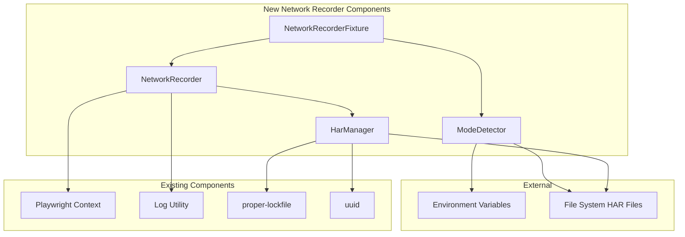

# SEON Playwright Utils - Network Traffic Recording & Replay Utility Architecture

## Introduction

This document outlines the architectural approach for enhancing **SEON Playwright Utils** with **Network Traffic Recording & Replay Utility**. Its primary goal is to serve as the guiding architectural blueprint for AI-driven development of new features while ensuring seamless integration with the existing system.

**Relationship to Existing Architecture:**
This document supplements existing project architecture by defining how new components will integrate with current systems. Where conflicts arise between new and existing patterns, this document provides guidance on maintaining consistency while implementing enhancements.

### Existing Project Analysis

**Current Project State:**

- **Primary Purpose:** TypeScript utility library for Playwright testing providing modular utilities as both standalone functions and Playwright fixtures
- **Current Tech Stack:** TypeScript 5.8.3 (strict mode), Node.js >=20.0.0, Playwright 1.54.1, dual CJS/ESM build system
- **Architecture Style:** "Functional core, fixture shell" pattern with modular utilities
- **Deployment Method:** Published to GitHub Packages registry as npm package

**Available Documentation:**

- Complete brownfield architecture analysis in `docs/bmad-method/brownfield-architecture.md`
- Module-specific documentation in `docs/` (api-request.md, auth-session.md, etc.)
- Comprehensive PRD in `docs/bmad-method/prd.md`
- Project README with development workflows
- TypeScript configurations for dual build system

**Identified Constraints:**

- Must maintain dual CJS/ESM build compatibility
- TypeScript strict mode compliance required
- Existing fixture patterns must be preserved
- Sample app testing approach must be extended
- Authentication-agnostic design required (no auth handling in network recorder)
- Node.js >=20.0.0 version constraint
- GitHub Packages registry publishing pipeline

### Change Log

| Change                        | Date       | Version | Description                                             | Author  |
| ----------------------------- | ---------- | ------- | ------------------------------------------------------- | ------- |
| Initial Architecture Creation | 2025-08-05 | 1.0     | Network Traffic Recording & Replay Utility Architecture | Winston |

## Enhancement Scope and Integration Strategy

### Enhancement Overview

**Enhancement Type:** New Feature Addition - Network Traffic Recording & Replay Utility
**Scope:** Complete HAR-based record/replay system with dual mode operation, file management, and fixture integration
**Integration Impact:** Moderate Impact - New utility module following existing patterns with integration points to current fixture system and build configuration

### Integration Approach

**Code Integration Strategy:** Follow established modular utility pattern with `src/network-recorder/` directory structure, integrating with existing fixture system via merged-fixtures pattern used in sample app

**Database Integration:** Not applicable - HAR files stored as JSON on filesystem using Node.js built-in fs operations, no database schema changes required

**API Integration:** Operates at Playwright browser context level using native `recordHar` and `routeFromHAR` APIs, no new API endpoints required - this is a testing utility, not a service

**UI Integration:** No direct UI changes - integrates with sample app testing scenarios to demonstrate record/replay functionality with existing movie CRUD operations

### Compatibility Requirements

- **Existing API Compatibility:** Must not interfere with existing api-request utility functions during recording or replay modes
- **Database Schema Compatibility:** Not applicable - no database schema involved
- **UI/UX Consistency:** Must follow existing fixture patterns and provide same developer experience as other playwright-utils utilities
- **Performance Impact:** <5ms overhead for non-recording tests, <50ms response latency in replay mode

## Tech Stack Alignment

### Existing Technology Stack

| Category         | Current Technology   | Version  | Usage in Enhancement                       | Notes                                        |
| ---------------- | -------------------- | -------- | ------------------------------------------ | -------------------------------------------- |
| Runtime          | Node.js              | >=20.0.0 | HAR file operations, environment detection | Required engine version constraint           |
| Language         | TypeScript           | 5.8.3    | All new code with strict mode              | Maintains existing type safety standards     |
| Test Framework   | Playwright           | 1.54.1   | Native recordHar/routeFromHAR APIs         | Peer dependency - core functionality         |
| Build System     | TypeScript Compiler  | -        | Dual CJS/ESM builds via multiple tsconfigs | Integration with existing build pipeline     |
| File Processing  | Built-in Node.js fs  | -        | HAR file read/write operations             | Consistent with existing file-utils approach |
| Pattern Matching | picomatch            | 4.0.3    | URL filtering for HAR recording            | Already available dependency                 |
| Unique IDs       | uuid                 | 11.1.0   | HAR file naming and conflict prevention    | Already available dependency                 |
| File Locking     | proper-lockfile      | 4.1.2    | Concurrent test execution safety           | Following auth-session pattern               |
| Logging          | Internal log utility | -        | Debug and operation logging                | Integration with existing log module         |

### New Technology Additions

**No new technologies required.** The enhancement uses only existing dependencies and Playwright's native capabilities.

## Data Models and Schema Changes

### New Data Models

#### NetworkRecorderConfig

**Purpose:** Configuration model for record/replay operations and HAR file management
**Integration:** Used by both standalone functions and Playwright fixtures, no integration with existing data models required

**Key Attributes:**

- `mode: 'record' | 'replay' | 'auto'` - Operation mode for the network recorder
- `harFilePath: string` - Absolute path to HAR file for recording or replay
- `urlFilter?: string` - Glob pattern for filtering URLs (e.g., '**/api/**')
- `harMode: 'minimal' | 'full'` - Level of detail to capture in HAR files
- `fallbackBehavior: 'record' | 'abort' | 'continue'` - Behavior when HAR file missing in replay mode
- `maxHarSize?: number` - Maximum HAR file size in bytes to prevent bloat

**Relationships:**

- **With Existing:** No direct relationships - operates independently of existing utilities
- **With New:** Used by all NetworkRecorder components for consistent configuration

#### HarFileMetadata

**Purpose:** Metadata model for HAR file organization and conflict prevention
**Integration:** Filesystem-only model, no database integration required

**Key Attributes:**

- `testName: string` - Test identifier for HAR file organization
- `timestamp: Date` - Creation timestamp for file versioning
- `recordingId: string` - Unique identifier to prevent concurrent conflicts
- `requestCount: number` - Number of recorded requests for validation
- `fileSize: number` - HAR file size for cleanup decisions
- `urlPattern: string` - URL filter pattern used during recording

**Relationships:**

- **With Existing:** No relationships with existing models
- **With New:** Referenced by NetworkRecorderConfig for file management

### Schema Integration Strategy

**Database Changes Required:**

- **New Tables:** None - this is a testing utility that operates on filesystem only
- **Modified Tables:** None - no database integration required
- **New Indexes:** None - HAR files are accessed by filepath, not database queries
- **Migration Strategy:** Not applicable - no database schema changes

**Backward Compatibility:**

- No database schema impact - maintains full backward compatibility
- HAR files stored in configurable directory structure outside existing data flows
- No changes to existing data models or API contracts

## Component Architecture

### New Components

#### NetworkRecorder

**Responsibility:** Core recording and replay functionality using Playwright's native HAR APIs
**Integration Points:** Integrates with Playwright browser contexts, uses existing log utility for debugging

**Key Interfaces:**

- `recordNetworkTraffic(context: BrowserContext, config: NetworkRecorderConfig): Promise<void>`
- `replayNetworkTraffic(page: Page, harFilePath: string): Promise<void>`
- `setupNetworkMode(config: NetworkRecorderConfig): Promise<BrowserContext>`

**Dependencies:**

- **Existing Components:** log utility for operation logging, existing Playwright context management
- **New Components:** HarManager for file operations, ModeDetector for environment detection

**Technology Stack:** TypeScript, Playwright native APIs, Node.js fs operations

#### HarManager

**Responsibility:** HAR file creation, validation, organization, and conflict prevention for concurrent tests
**Integration Points:** Uses existing proper-lockfile pattern from auth-session, integrates with log utility

**Key Interfaces:**

- `createHarFilePath(testName: string, config: NetworkRecorderConfig): string`
- `validateHarFile(filePath: string): Promise<boolean>`
- `cleanupOldHarFiles(directory: string, maxAge: number): Promise<void>`

**Dependencies:**

- **Existing Components:** proper-lockfile for concurrent safety, uuid for unique naming
- **New Components:** Used by NetworkRecorder for all file operations

**Technology Stack:** Node.js fs/path, proper-lockfile, uuid

#### ModeDetector

**Responsibility:** Environment variable detection and automatic mode switching logic
**Integration Points:** No dependencies on existing components - pure environment detection

**Key Interfaces:**

- `detectNetworkMode(): 'record' | 'replay' | 'auto'`
- `shouldAutoRecord(harFilePath: string): Promise<boolean>`
- `getHarStorageConfig(): { baseDir: string, maxSize: number }`

**Dependencies:**

- **Existing Components:** None - operates independently
- **New Components:** Used by NetworkRecorder and NetworkRecorderFixture

**Technology Stack:** Node.js process.env, fs operations for file existence checks

#### NetworkRecorderFixture

**Responsibility:** Playwright fixture implementation providing same API as standalone functions
**Integration Points:** Integrates with existing merged-fixtures pattern, uses all new components

**Key Interfaces:**

- Fixture interface matching existing fixture patterns in playwright-utils
- `networkRecorder.record()`, `networkRecorder.replay()`, `networkRecorder.setupMode()`

**Dependencies:**

- **Existing Components:** Follows existing fixture patterns from auth-session and api-request
- **New Components:** Orchestrates NetworkRecorder, HarManager, and ModeDetector

**Technology Stack:** Playwright Test fixture system, TypeScript

### Component Interaction Diagram



## Source Tree Integration

### Existing Project Structure

```text
src/
├── index.ts                     # Main entry (plain functions only)
├── api-request/                 # HTTP client for typed API requests
├── auth-session/                # Authentication session management
│   └── internal/               # Internal auth implementation details
├── file-utils/                 # File reading/validation (CSV, XLSX, PDF, ZIP)
│   └── core/                   # Core file processing logic
├── intercept-network-call/     # Network request interception and mocking
│   └── core/                   # Network interception implementation
├── log/                        # Structured logging integrated with Playwright
│   ├── formatters/             # Message formatting logic
│   ├── outputs/                # Console and file output handlers
│   └── utils/                  # Logging utilities
├── recurse/                    # Polling utility for async conditions
└── internal/                   # Shared internal utilities
```

### New File Organization

```text
src/
├── index.ts                     # Updated with network-recorder exports
├── network-recorder/            # NEW: Network traffic recording & replay
│   ├── index.ts                 # Main exports (functions and types)
│   ├── fixtures.ts              # Playwright fixture exports
│   ├── network-recorder-fixture.ts # Fixture implementation
│   ├── network-recorder.ts      # Core recording/replay logic
│   └── core/                    # Core implementation components
│       ├── har-manager.ts       # HAR file management
│       ├── mode-detector.ts     # Environment/mode detection
│       ├── types.ts             # TypeScript definitions
│       └── utils/               # Utility functions
│           └── file-organizer.ts # HAR file organization
├── [existing folders unchanged]
```

### Integration Guidelines

- **File Naming:** Following existing camelCase for TypeScript files, kebab-case for multi-word files (network-recorder-fixture.ts)
- **Folder Organization:** Core implementation in `core/` subdirectory matching existing patterns (file-utils/core/, intercept-network-call/core/)
- **Import/Export Patterns:** Main exports through index.ts, fixtures through separate fixtures.ts file, following established patterns

## Infrastructure and Deployment Integration

### Existing Infrastructure

**Current Deployment:** Published as npm package to GitHub Packages registry under @seontechnologies scope
**Infrastructure Tools:** GitHub Actions for CI/CD, npm for package management, TypeScript compiler for builds
**Environments:** Development (local), CI/CD (GitHub Actions), Package Registry (GitHub Packages)

### Enhancement Deployment Strategy

**Deployment Approach:** Integrate with existing package publishing pipeline, no separate deployment required
**Infrastructure Changes:** None - utilizes existing dual CJS/ESM build system and GitHub Packages publishing
**Pipeline Integration:** Add network-recorder module to existing tsconfig builds, include in subpath exports in package.json

### Rollback Strategy

**Rollback Method:** Standard npm package versioning - can revert to previous package version if issues arise
**Risk Mitigation:** Comprehensive testing in sample app before publishing, gradual rollout through version bumping
**Monitoring:** Integration with existing log utility provides debugging capabilities, HAR file validation prevents corruption

## Coding Standards and Conventions

### Existing Standards Compliance

**Code Style:** TypeScript strict mode with comprehensive type coverage, functional programming patterns preferred
**Linting Rules:** ESLint with existing configuration, Prettier for code formatting
**Testing Patterns:** Jest for unit tests, Playwright for integration tests, sample app for comprehensive scenarios
**Documentation Style:** JSDoc comments for functions, module documentation in docs/ directory

### Critical Integration Rules

- **Existing API Compatibility:** Network recorder must not interfere with existing api-request, auth-session, or intercept-network-call utilities
- **Database Integration:** Not applicable - network recorder operates independently of database concerns
- **Error Handling:** Use existing log utility for error reporting, provide clear error messages with actionable guidance
- **Logging Consistency:** Integrate with existing log utility for debug output, follow established logging levels and formats

## Testing Strategy

### Integration with Existing Tests

**Existing Test Framework:** Jest for unit tests (backend), Vitest for frontend components, Playwright for integration tests
**Test Organization:** Tests organized by utility type in playwright/tests/, sample app tests demonstrate real usage
**Coverage Requirements:** Maintain existing coverage standards, ensure new functionality is comprehensively tested

### New Testing Requirements

#### Unit Tests for New Components

- **Framework:** Jest following existing backend testing patterns
- **Location:** `src/network-recorder/__tests__/` directory structure
- **Coverage Target:** >90% coverage for core components (HarManager, ModeDetector, NetworkRecorder)
- **Integration with Existing:** Use existing test utilities and mocking patterns

#### Integration Tests

- **Scope:** Full record/replay workflows using sample app scenarios
- **Existing System Verification:** All existing tests must continue passing when network recorder is not active
- **New Feature Testing:** Record/replay modes with movie CRUD operations, performance benchmarks

#### Regression Testing

- **Existing Feature Verification:** Automated verification that auth-session, api-request, and other utilities remain unaffected
- **Automated Regression Suite:** Integration with existing CI/CD pipeline
- **Manual Testing Requirements:** Manual verification of HAR file quality and replay accuracy

## Security Integration

### Existing Security Measures

**Authentication:** Handled by existing auth-session utilities at browser context level
**Authorization:** Not applicable for testing utility
**Data Protection:** HAR files may contain sensitive data - must provide filtering capabilities
**Security Tools:** Integration with existing linting and security scanning in CI/CD

### Enhancement Security Requirements

**New Security Measures:** URL filtering to exclude authentication endpoints by default, HAR file sanitization options
**Integration Points:** Must respect existing authentication boundaries, no interference with auth-session security
**Compliance Requirements:** HAR files should not contain authentication tokens or sensitive headers by default

### Security Testing

**Existing Security Tests:** No impact on existing security testing
**New Security Test Requirements:** Verify URL filtering prevents auth token leakage, test HAR file sanitization
**Penetration Testing:** Not applicable for testing utility

## Next Steps

### Story Manager Handoff

Ready for story implementation with the following validated requirements:

- Architecture document completed with user validation of existing system analysis
- Integration approach confirmed to respect existing modular utility patterns
- Technical constraints identified from actual project analysis (dual CJS/ESM, TypeScript strict mode, authentication separation)
- Component architecture follows established patterns from auth-session and api-request utilities
- HAR-based approach using Playwright native APIs confirmed as optimal technical choice

**Key Integration Requirements Validated:**

- Authentication-agnostic design confirmed with user
- Modular structure following existing src/{utility}/ pattern
- Fixture integration using established merged-fixtures approach
- Build system integration with existing dual CJS/ESM configuration

**First story recommendation:** Begin with Story 1.1 (Core HAR Management Infrastructure) as it establishes the foundation without touching Playwright APIs, allowing validation of file organization and build integration.

### Developer Handoff

Implementation ready with complete architectural guidance:

- Technical decisions based on actual project constraints from brownfield analysis
- Integration requirements validated through existing codebase patterns
- Component boundaries established to minimize risk to existing functionality
- Clear file structure and naming conventions following established patterns

**Critical Implementation Notes:**

- Use existing proper-lockfile pattern from auth-session for concurrent test safety
- Follow existing fixture patterns exactly as seen in api-request and auth-session
- Integrate with existing log utility for consistent debugging experience
- Maintain TypeScript strict mode compliance throughout implementation

**Risk Mitigation Approach:**

- Implement incrementally following story sequence to minimize existing system impact
- Each story includes integration verification steps to ensure existing functionality remains intact
- Comprehensive testing in sample app before any package publishing

---

This comprehensive architecture document provides the complete technical blueprint for implementing the Network Traffic Recording & Replay Utility while ensuring seamless integration with the existing SEON Playwright Utils architecture.
